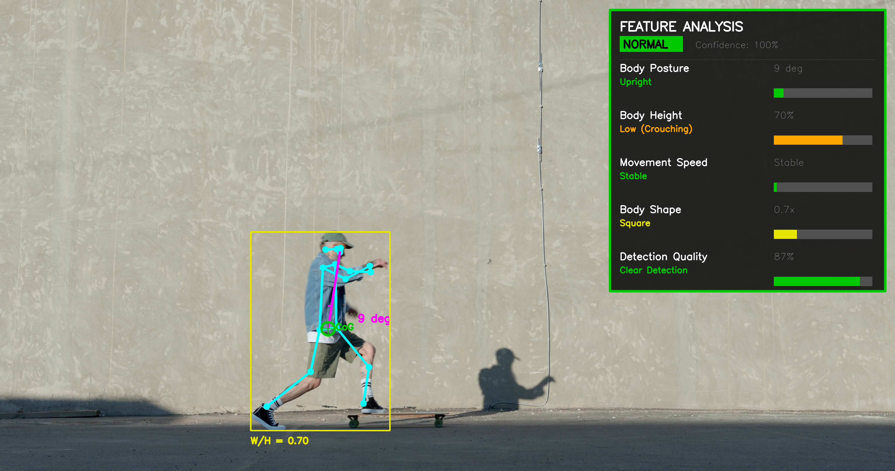
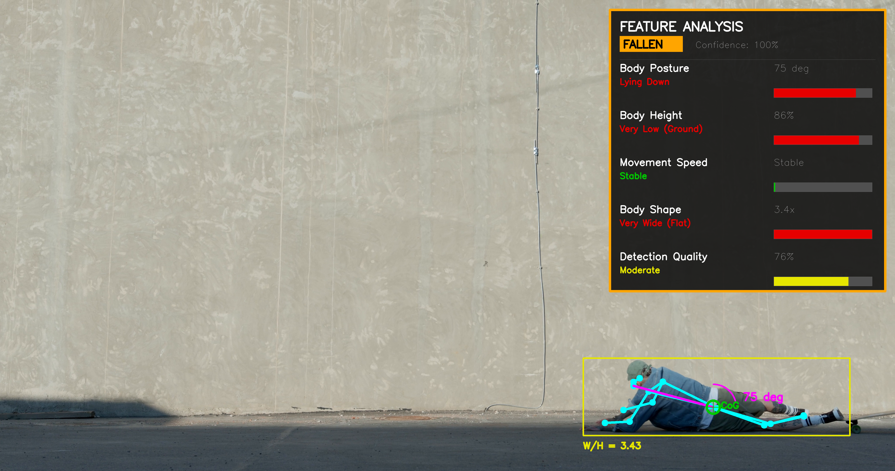
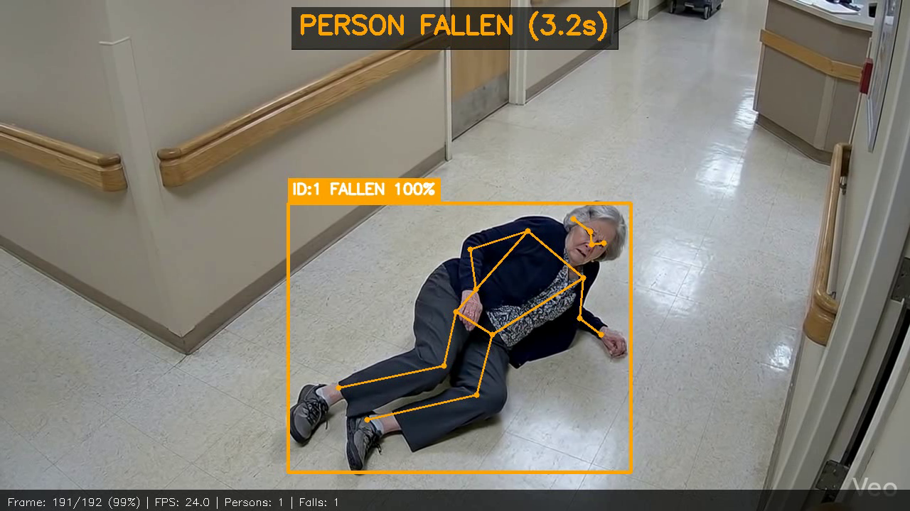
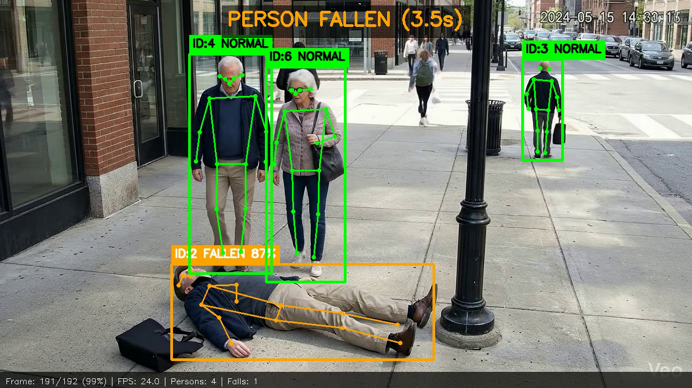
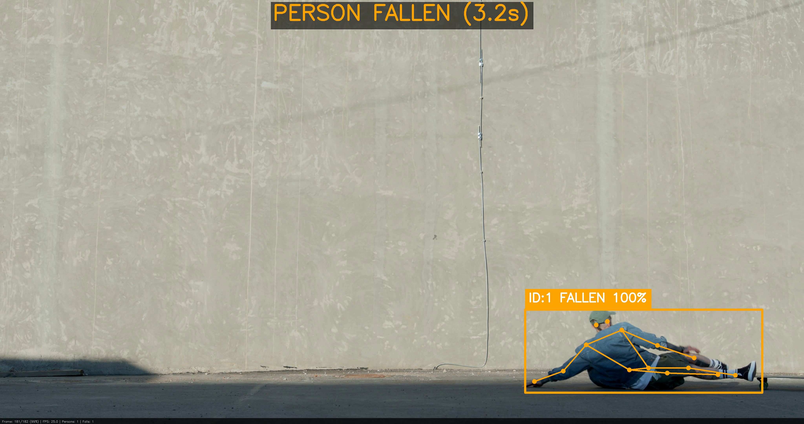
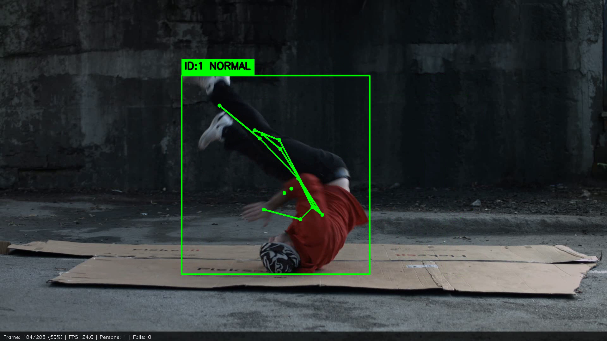
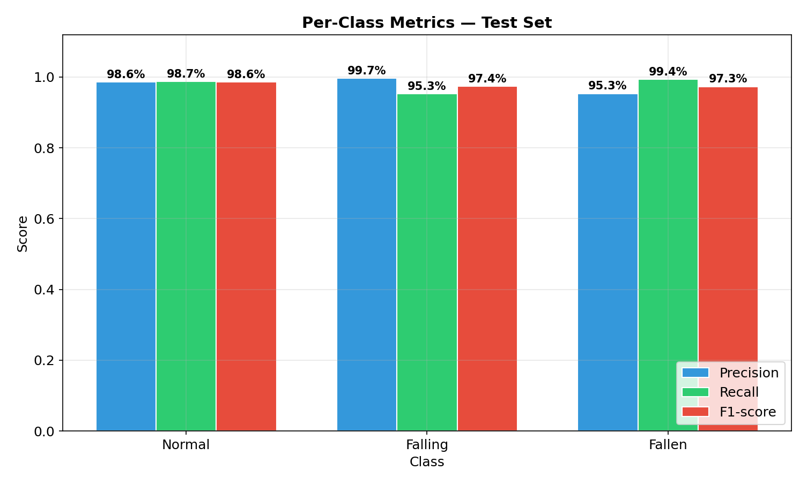
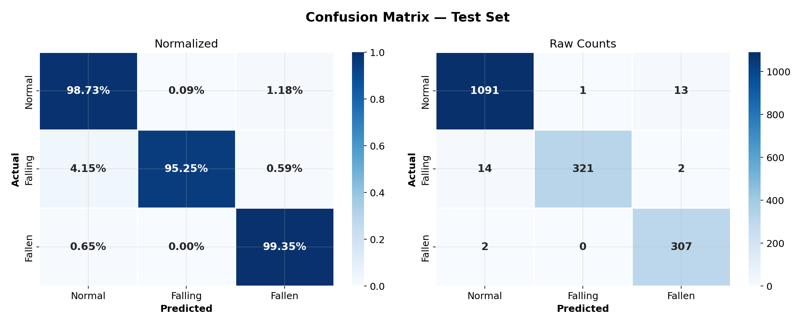
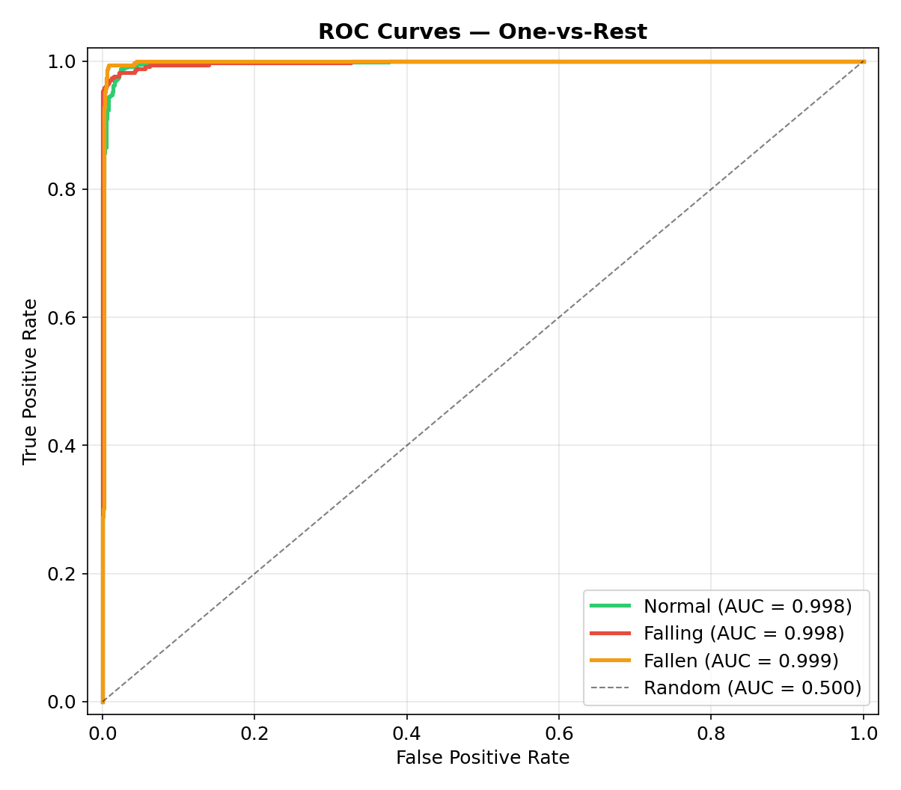
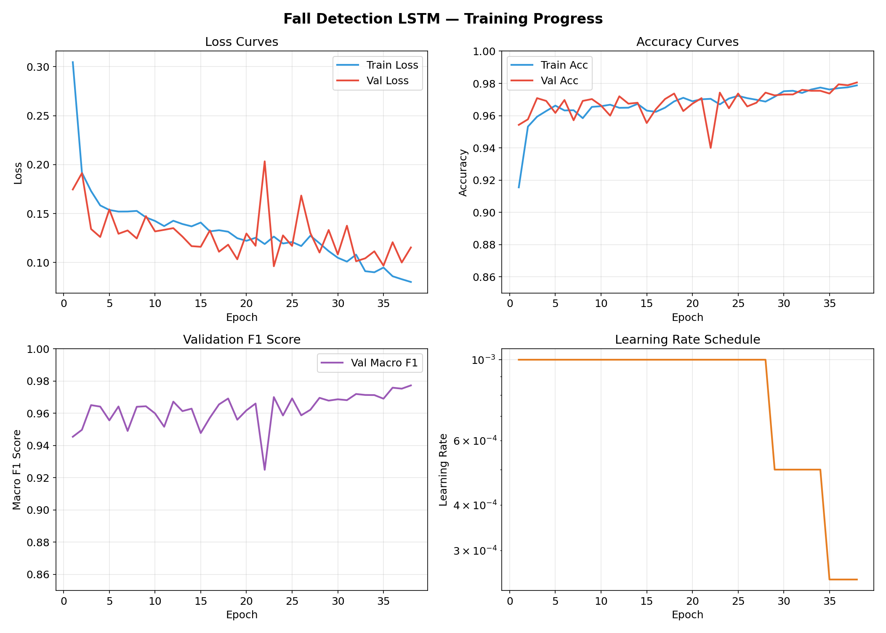

# Elderly Fall Detection System

A real-time video-based fall detection system that uses **skeleton pose estimation** and **temporal deep learning** to detect when a person falls and stays on the ground. Designed for elderly care facilities, hospitals, and smart home monitoring.

---

## Why This Matters

| The Problem | The Impact |
|-------------|-----------|
| **684,000** older adults die from falls globally each year (WHO) | Falls are the **#1 cause of injury death** among people aged 65+ |
| **37.3 million** falls per year are severe enough to require medical attention | Average hospital cost per fall: **$35,000+** |
| **95% of hip fractures** are caused by falling | A person lying on the floor for **>1 hour** has 50% mortality rate within 6 months |

**The critical factor is response time.** If a fall is detected within minutes and help arrives quickly, outcomes improve dramatically. This system provides **automated, real-time fall detection** without requiring the person to wear any device.

---

## How It Works

The system processes video through a 4-stage pipeline:

```
Video Frame
    |
    v
[1] YOLO11-Pose  ------>  Detects people + 17 skeleton keypoints
    |
    v  
[2] BoT-SORT Tracker -->  Tracks each person across frames (persistent ID)
    |
    v
[3] Feature Extraction ->  Computes 5 biomechanical features per person per frame
    |
    v
[4] LSTM Classifier ---->  Classifies 30-frame sequences: NORMAL / FALLING / FALLEN
    |
    v
Annotated Video + JSON Event Log + Alerts
```

### The 5 Extracted Features

Each frame, the system computes these features from the skeleton keypoints:

| Feature | What It Measures | Normal | Fallen |
|---------|-----------------|--------|--------|
| **Body Posture** | Angle between hip-to-nose line and vertical | ~9° (upright) | ~75° (lying) |
| **Body Height** | Center of gravity position in the frame | High (standing) | Very Low (ground) |
| **Movement Speed** | How fast the body is dropping | Stable | Rapid drop during fall |
| **Body Shape** | Bounding box width-to-height ratio | 0.5-0.7 (tall/narrow) | 2.0-3.5 (wide/flat) |
| **Detection Quality** | Average skeleton keypoint confidence | High (~90%) | Moderate (~76%) |

### Feature Visualization: Normal vs Fallen

**Standing (Normal)** — Upright posture, body angle 9°, narrow bounding box:



**Fallen** — Lying on ground, body angle 75°, wide/flat bounding box, all indicators turn red:



---

## Demo Results

The system was tested on real-world videos with diverse scenarios:

### Elderly Person Fall (Hospital Corridor)



*Fall detected with persistent "PERSON FALLEN" alert and duration timer. Orange skeleton and bounding box indicate fallen state.*

### Outdoor Fall (Sidewalk with Bystanders)



*System correctly identifies the fallen person (ID:2, orange) while classifying standing pedestrians as NORMAL (green). Multi-person tracking works in crowded scenes.*

### Skater Fall (4K Video)



*Fall detected at 98% confidence. Labels and skeleton scale automatically with video resolution.*

### No False Positive (Breakdancer)



*Breakdancer performing on the ground is correctly classified as NORMAL — the system distinguishes intentional movements from accidental falls.*

---

## Model Performance

### Overall Metrics

| Metric | Score |
|--------|-------|
| **Accuracy** | 98.2% |
| **Macro F1** | 97.8% |
| **Macro AUC** | 0.998 |
| **Fall Recall** | 95.3% |
| **False Positive Rate** | 1.5% |

### Per-Class Performance



| Class | Precision | Recall | F1-Score | AUC |
|-------|-----------|--------|----------|-----|
| **Normal** | 98.6% | 98.7% | 98.6% | 0.998 |
| **Falling** | 99.7% | 95.3% | 97.4% | 0.998 |
| **Fallen** | 95.3% | 99.4% | 97.3% | 0.999 |

### Confusion Matrix



### ROC Curves



*Near-perfect AUC scores across all three classes, demonstrating strong discriminative ability.*

### Training Progress



*Model converged within 38 epochs with early stopping. Training completed in 33 seconds on RTX 5070.*

---

## Three Detection States

The system classifies each tracked person into one of three states:

| State | Visual | Description |
|-------|--------|-------------|
| **NORMAL** | Green skeleton + bbox | Person is standing, walking, or sitting normally |
| **FALLING** | Red skeleton + bbox + alert | Active fall in progress — "!! FALL DETECTED !!" |
| **FALLEN** | Orange skeleton + bbox + timer | Person is on the ground — "PERSON FALLEN (Xs)" with duration |

Once a fall is detected, the **FALLEN state persists** with a running timer until the person clearly stands back up. This ensures continuous monitoring even if the person remains motionless on the ground.

---

## Tech Stack

| Component | Technology | Purpose |
|-----------|-----------|---------|
| **Pose Estimation** | YOLO11-Pose (Ultralytics) | Real-time person detection + 17 skeleton keypoints |
| **Tracking** | BoT-SORT | Multi-person tracking with re-identification |
| **Feature Extraction** | Custom Python | 5 biomechanical features from skeleton data |
| **Temporal Classifier** | LSTM (PyTorch) | Classify 30-frame sequences into 3 states |
| **Video I/O** | OpenCV | Read/write video files with annotation overlays |
| **Training Data** | UR Fall + Le2i + Synthetic | 17,502 samples from 210 real videos + augmentation |

### Architecture Details

```
LSTM Model (201,859 parameters)
├── Input:  (batch, 30 frames, 5 features)
├── LSTM:   2 layers, 128 hidden units, dropout=0.3
├── LayerNorm
├── Dropout (0.3)
├── Linear: 128 → 3 classes
└── Output: [Normal, Falling, Fallen] probabilities
```

---

## Dataset

Training data was collected from multiple sources and processed through the full YOLO+BoT-SORT pipeline:

| Source | Videos | Type | Content |
|--------|--------|------|---------|
| **UR Fall Detection** | 70 | Image sequences | 30 falls + 40 daily activities (indoor, Kinect) |
| **Le2i Fall Dataset** | 140 | Video files | 70 falls + 70 normal (4 room types, CCTV) |
| **Synthetic** | — | Generated | 3,000 feature sequences with realistic fall patterns |

**Processing pipeline:** Each video was processed through YOLO11-Pose + BoT-SORT to extract skeleton keypoints, then sliced into 30-frame sliding windows with stride 15.

| Split | Samples |
|-------|---------|
| Train | 14,001 |
| Validation | 1,750 |
| Test | 1,751 |
| **Total** | **17,502** |

---

## Quick Start

### Installation

```bash
# Clone the repository
git clone <repo-url>
cd fall-detection

# Create virtual environment
python3 -m venv venv
source venv/bin/activate

# Install dependencies
pip install -r requirements.txt
```

### Run Fall Detection on a Video

```bash
python detect_falls.py \
    --input your_video.mp4 \
    --output result.mp4 \
    --json-log events.json
```

### Options

| Argument | Default | Description |
|----------|---------|-------------|
| `--input` | (required) | Input video file path |
| `--output` | None | Output annotated video path |
| `--json-log` | None | JSON event log output path |
| `--confidence` | 0.40 | Fall detection confidence threshold |
| `--device` | auto | `cuda` or `cpu` |
| `--model` | `models/checkpoints/best.pth` | LSTM model checkpoint |

### Output

The system produces:
1. **Annotated video** — skeletons, bounding boxes, fall alerts, status bar
2. **JSON event log** — structured data with timestamps, confidence scores, track IDs

```json
{
  "events": [
    {
      "type": "fall",
      "track_id": 1,
      "start_frame": 114,
      "timestamp_start": "00:00:04.750",
      "confidence": 0.84
    }
  ],
  "summary": {
    "total_falls": 1,
    "persons_tracked": 5
  }
}
```

---

## Project Structure

```
fall-detection/
├── detect_falls.py              # CLI entry point
├── models/
│   ├── fall_detector.py         # LSTM model definition
│   └── checkpoints/
│       ├── best.pth             # Trained model weights
│       └── training_report.json # Training metrics
├── src/
│   ├── detector.py              # YOLO pose + BoT-SORT tracking
│   ├── video_io.py              # Video read/write utilities
│   ├── feature_extraction.py    # 5 biomechanical features
│   ├── track_manager.py         # Per-person sliding window buffers
│   ├── pipeline.py              # End-to-end inference pipeline
│   ├── dataset.py               # PyTorch Dataset/DataLoader
│   ├── train.py                 # LSTM training loop
│   └── evaluate.py              # Metrics & visualization
├── configs/
│   └── botsort.yaml             # Tracker configuration
├── scripts/
│   ├── prepare_data.py          # Data preparation pipeline
│   ├── batch_test.py            # Batch video testing
│   └── visualize_features.py    # Feature visualization
├── tests/                       # 93 unit tests
├── evaluation/                  # Metrics plots & model card
└── docs/images/                 # README images
```

---

## Key Features

- **No wearable device required** — works with any standard camera
- **Multi-person tracking** — monitors multiple people simultaneously with persistent IDs
- **Three-state detection** — distinguishes Normal, Falling (active), and Fallen (on ground)
- **Persistent fall alerts** — "PERSON FALLEN" state stays active with duration timer until person stands up
- **Resolution adaptive** — labels and overlays scale automatically from 720p to 4K
- **Real-time capable** — 40-50 FPS on 720p, 12 FPS on 4K (RTX 5070)
- **Low false positives** — breakdancing, yoga, sitting on floor correctly classified as normal
- **JSON event logging** — structured output for integration with alert systems
- **Graceful handling** — corrupt videos, missing persons, GPU OOM all handled without crashes

---

## Limitations & Future Work

### Current Limitations
- Trained primarily on indoor/surveillance-style footage — performance may vary in unusual environments
- Requires at least 30 frames (~1 second) of tracking before classification begins
- Very small persons (far from camera) may have noisy keypoint estimates
- Some edge cases (person sitting down very quickly) may trigger brief false alerts

### Future Improvements
- Add more skeleton features (leg angle, arm position, torso rotation) for better accuracy
- Save raw keypoints during processing to avoid reprocessing videos
- Fine-tune on domain-specific data (specific camera angles, environments)
- Add real-time camera stream support
- Deploy as edge application on NVIDIA Jetson
- Web UI for non-technical users (Streamlit/Gradio)
- Alert integration (SMS, email, alarm system)

---

## License

This project is for educational and research purposes.

### Dataset Acknowledgments
- [UR Fall Detection Dataset](https://fenix.ur.edu.pl/mkepski/ds/uf.html) — University of Rzeszow
- [Le2i Fall Dataset](https://www.kaggle.com/datasets/tuyenldvn/falldataset-imvia) — Le2i/IMVIA Lab
- YOLO11-Pose model by [Ultralytics](https://docs.ultralytics.com/)
